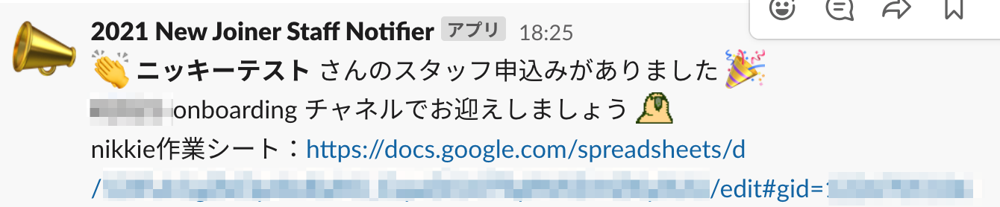
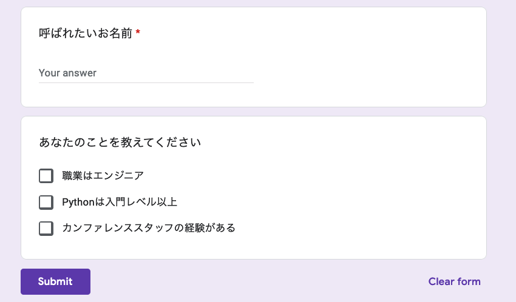

.. role:: raw-html(raw)
    :format: html

========================================================================================================================
私のアツいPyCon JP 2021スタッフ活動＝GAS活！
========================================================================================================================

:Event: Google Apps Script 活用ミートアップ #8
:Presented: 2021/11/22 nikkie

私のアツいPyCon JP 2021スタッフ活動＝GAS活！（フォームの回答通知）
========================================================================================================================

始まります！！🙌 `ﾌﾌｯﾋ <https://dic.pixiv.net/a/%E3%83%95%E3%83%95%E3%83%83%E3%83%92>`_

お前、誰よ（≒自己紹介）
============================================================

* Python大好き **にっきー** （:raw-html:`<i class="fab fa-twitter"></i>` `@ftnext <https://twitter.com/ftnext>`_ / :raw-html:`<i class="fab fa-github"></i>` `@ftnext <https://github.com/ftnext>`_）
* Python歴4年。株式会社ユーザベースのデータサイエンティスト（NLPer）
* アニメも大好き

『`アイの歌声を聴かせて <https://ainouta.jp/>`_』はいいぞ！🤖🎤🎼
------------------------------------------------------------------------------------------------

.. raw:: html

    <iframe width="800" height="480" src="https://ftnext.github.io/2021_slides/pycon_shizu_lt/enjoy_favorite_anime_with_python.html#/2/5"
        title="Pythonと一緒に！　好きなアニメ映画のファン活動（2021/11 PyCon mini Shizuoka LT）"></iframe>

お前、誰よ
------------------------------------------------

* 10/15, 16開催の **Py** thon **Con** ference JP 2021の座長🇨🇭でした
* ＝PyCon JP 2021の開催に責任を持つ人

「繰り返すタスクはPythonにやらせよう」
------------------------------------------------

* スタッフ活動の中で、自分が繰り返しているタスクを **自動化** してきました

  * 決まった期間、Slackで繰り返し投稿
  * Googleフォームに回答があったことの確認

このLTでは
------------------------------------------------

* 「Googleフォームの回答を通知」という要件の実装について話します
* PyCon JP 2020のスタッフ活動の中で、Pythonで実装しました
* 2021年の活動の中で、 **GASでの実装に切り替え** ました

私のアツいPyCon JP 2021スタッフ活動＝GAS活！ **始まります！！**
------------------------------------------------------------------------------------------------

* 要件「Googleフォームの回答を通知」
* Pythonで通知を実装
* GASで通知を実装

要件「Googleフォームの回答を通知」
============================================================

Googleフォームをheavy use
------------------------------------------------

* スタッフ応募、スポンサー応募、レビュアー応募など、**至るところでGoogleフォーム** を使う
* フォームからスプレッドシートに連携する機能もよく使う
* Confluence `Google Documents(Slides/Sheets/Docs...) <https://pyconjp.atlassian.net/l/c/X1NXf2Ex>`_

通知先はどこに？ PyCon JP **Slack** に！
------------------------------------------------

* スタッフ用のSlack workspaceがある

  * Confluence `Slack <https://pyconjp.atlassian.net/l/c/rN1T8k7P>`_

* 通知にはIncoming Webhookを使う

投稿方法：Incoming WebhookのURLにHTTPリクエスト送信
------------------------------------------------------------------------------------------------

.. code-block:: shell

  curl -X POST --data-urlencode "payload={\"text\": \"Spam ham\"}" \
    https://hooks.slack.com/services/...

* `スタッフマニュアルの記載 <https://manual.pycon.jp/appendix/templates.html#webhook-url>`_ に沿って生成
* Incoming Webhookの設定ページ内の例を参照

例：スタッフ応募フォームに回答があったことをSlack通知
------------------------------------------------------------------------------------------------

このあと話す、GASでの実装です

私のアツいPyCon JP 2021スタッフ活動＝GAS活！ 話し始めてます！！
------------------------------------------------------------------------------------------------

* 要件「Googleフォームの回答を通知」
* **Pythonで通知を実装** （2020）
* GASで通知を実装（2021）

Pythonで通知を実装
============================================================

* フォームと連携した **スプレッドシート** を読み取って通知する
* この処理を定期的に動かす

詳しくはPyCon JP 2020で話しています
------------------------------------------------

.. raw:: html

    <iframe width="560" height="315" src="https://www.youtube.com/embed/VBeJU9o9API?start=225" title="YouTube video player" frameborder="0" allow="accelerometer; autoplay; clipboard-write; encrypted-media; gyroscope; picture-in-picture" allowfullscreen></iframe>

`スタッフとしてコードを書こう！〜Code for PyCon JP and yourself〜 <https://pycon.jp/2020/timetable/?id=203919>`_

フォームと連携したスプレッドシート
------------------------------------------------

* 各行について **通知済みか否かを記録** するための列を追加

.. list-table::
    :header-rows: 1

    * - 質問A
      - 質問B
      - 通知済み
    * - 1件目の回答A
      - 1件目の回答B
      - ◯
    * - 2件目の回答A
      - 2件目の回答B
      - 

Slack投稿
------------------------------------------------

* ライブラリ ``gspread`` でスプレッドシートを読み書きする
* 通知する必要のある行の分だけ、Incoming Webhookを通してSlackに投稿（`urllib <https://docs.python.org/ja/3/howto/urllib2.html#data>`_）

定期実行
------------------------------------------------

* スプレッドシートを読み取り、通知するスクリプトを **AWS Lambda** の関数に移植
* **Amazon CloudWatch Events** でLambda関数を定期的に実行する（例：半日に1回）

Pythonによる実装の総括
------------------------------------------------

* Slackを見ているだけでGoogleフォームの応募に気付けるようになった🙌
* 伸びしろは **即時性** （リアルタイムでない）

  * 半日に1回起動する設定なので、通知が最大で半日遅れる

私のアツいPyCon JP 2021スタッフ活動＝GAS活！ 話し始めてます！
------------------------------------------------------------------------------------------------

* 要件「Googleフォームの回答を通知」
* Pythonで通知を実装（2020）
* **GASで通知を実装** （2021）

GASで通知を実装
============================================================

* フォームが送信されたイベントをトリガーに、Slackに通知する処理を実行する
* ＝フォームの応募が **即時通知** される！
* Pythonではできないが、Google App Script（GAS）なるものでできるらしい

Python使いnikkieとGAS
------------------------------------------------

* Pythonと比べたら、JavaScript（GAS）全然スラスラ書けない・・・
* 先人のアウトプットを参考にする

  * Qiita `Googleformからのslack通知設定方法 <https://qiita.com/pchan52/items/574e930a3cc42cf7f8b9>`_

GASによる実装
------------------------------------------------

* Slack通知は、GASからIncoming Webhookにリクエストする
* フォーム送信イベントがトリガー： **イベントを引数に受け取る関数** を実装

  * ``From form - On form submit`` でその関数が実行されるようにTriggerを作る

今回のLT用のフォーム
------------------------------------------------

https://forms.gle/r6gZ2vaKWxp5yhhq9

GASからHTTPリクエスト
------------------------------------------------

.. code-block:: javascript
  :linenos:

  const url = "Incoming Webhook URL";
  const options = {
    "method": "POST",
    "contentType": "application/json",
    "payload": JSON.stringify({text: "Spam ham"}),
  };
  UrlFetchApp.fetch(url, options);

`https://developers.google.com/apps-script/reference/url-fetch/url-fetch-app#fetch(String,Object) <https://developers.google.com/apps-script/reference/url-fetch/url-fetch-app#fetch(String,Object)>`_

``From form - On form submit`` イベント
------------------------------------------------

https://developers.google.com/apps-script/guides/triggers/events#google_forms_events

* このイベントのプロパティ

  * ``source``
  * ``response`` 👈 こちらのデータにアクセス

``FormResponse`` オブジェクト
------------------------------------------------

* **フォームの回答** を表す
* ``getItemResponses()`` メソッドで ``ItemResponse`` からなる配列を取得

.. code-block:: javascript
  :linenos:

  function onFormSubmit(e) {  // From form - On form submit イベントに登録する
    const itemResponses = e.response.getItemResponses();
    // 続くスライドをお楽しみに
  }

``ItemResponse`` オブジェクト
------------------------------------------------

* 質問文は ``getItem().getTitle()`` で取れる
* 回答は ``getResponse()`` で取れる

.. code-block:: javascript
  :linenos:
  :emphasize-lines: 4-5

  function onFormSubmit(e) {
    const itemResponses = e.response.getItemResponses();
    const qaPairs = itemResponses.map((formData) => {
      let question = formData.getItem().getTitle();
      let answer = formData.getResponse();
      return [question, answer];
    });
  }

参考実装をリファクタリング
------------------------------------------------

* スタッフ活動中はQiitaの記事の通りで動かしていた（動いて価値を出しているのは正義）
* 質問文に応じて条件分岐する ``switch`` 文、やや変更しづらい
* このLTを機に、**質問文をキー、回答を値** とする ``Map`` を組み立てるように変更

通知文面組み立て
------------------------------------------------

.. code-block:: javascript
  :linenos:
  :emphasize-lines: 8-10

  function onFormSubmit(e) {
    const itemResponses = e.response.getItemResponses();
    const qaPairs = itemResponses.map((formData) => {
      let question = formData.getItem().getTitle();
      let answer = formData.getResponse();
      return [question, answer];
    });
    const questionToAnswer = new Map(qaPairs);
    const name = questionToAnswer.get("呼ばれたいお名前");
    const text = `${name}さんの申込みがありました！`;
    // Slackに送る処理を呼び出す
  }

GASでSlack通知、実装できました🙌
------------------------------------------------------------------------------------------------

まとめ：私のアツいPyCon JP 2021スタッフ活動＝GAS活！
========================================================================================================================

* フォームの回答通知をPythonに代えて **GASにしたことで、通知の即時性** がもたらされた
* フォーム送信イベントをトリガーにするので、Pythonスクリプトを定期実行していたような **環境も不要** に

Future works 1/2
------------------------------------------------

* Incoming Webhookのやり方がlegacyになっていることに気付いた
* `新しいやり方（Slack App作成？） <https://slack.com/intl/ja-jp/help/articles/115005265063>`_ に移行せねば

Future works 2/2
------------------------------------------------

* 今回のLTを機にGASのドキュメントを当たる 👉 他のフォームにも流用できるスクリプト完成！
* 新しいフォームに対してテンプレートを埋める形でGASを作り、**他のスタッフも使えるように** したい

ご清聴ありがとうございました
------------------------------------------------

フィードバック歓迎！もっといいやり方思いついた方は教えてください
