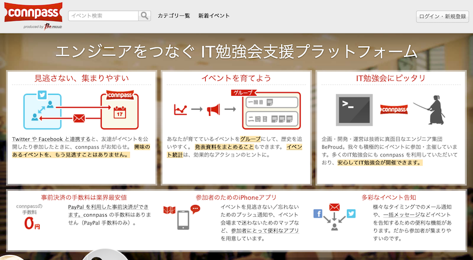
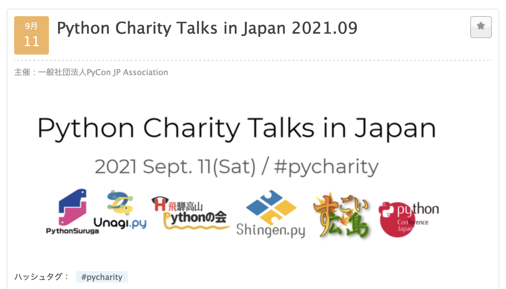

.. role:: raw-html(raw)
    :format: html

========================================================================================================================
週に数回connpassのイベントを作るPyCon JPスタッフは、Heliumを使って自動化しました
========================================================================================================================

週に数回connpassのイベントを作るPyCon JPスタッフは、Heliumを使って自動化しました
========================================================================================================================

:Event: Python Charity Talks in Japan
:Presented: 2021/09/11 nikkie

お前、誰よ
============================================================

* Python大好き **にっきー** （:raw-html:`<i class="fab fa-twitter"></i>` `@ftnext <https://twitter.com/ftnext>`_ / :raw-html:`<i class="fab fa-github"></i>` `@ftnext <https://github.com/ftnext>`_）
* PyCon JP 2021 座長🇨🇭
* アニメも大好き。最近好きな挨拶「うぃっす✌️」🐙

お前、誰よ（ ``@skip`` ）
------------------------------------------------

* Python歴もうじき4年。株式会社ユーザベースのデータサイエンティスト（NLPer）
* `Start Python Club（みんなのPython勉強会） <https://startpython.connpass.com/>`_ 4代目LT王子、スタッフ
* 最近エモかったPEP：Inadaさんによる `PEP597 <https://www.python.org/dev/peps/pep-0597/>`_

週に数回connpassのイベントを作る **PyCon JP** スタッフは、Heliumを使って自動化しました
========================================================================================================================

``import PythonConference as PyCon``
------------------------------------------------

10/15(金), 16(土) 開催です！
------------------------------------------------

.. raw:: html

    <iframe width="640" height="480" src="https://2021.pycon.jp/" title="PyCon JP 2021 Webサイト"></iframe>

PyCon JP 2021 チケット発売中！
------------------------------------------------

* https://pyconjp.connpass.com/event/221241/ （申込250名(50%)超え🎉）
* 早期購入特典🍕、まだ間に合う！🇲🇬

PyCon JP 2021では現在（ ``@skip`` ）
------------------------------------------------

* `9/17(金)まで <https://pyconjp.blogspot.com/2021/09/closed-sponsor-application.html>`_ 、 `スポンサー募集中 <https://pyconjp.blogspot.com/2021/06/pycon-jp-2021-2notice-of-start-of.html>`_
* `9月末まで、サポートスタッフを募集中 <https://pyconjp.blogspot.com/2021/09/pyconjp-2021-support-staff.html>`_ Help, please!🙏
* :raw-html:`<i class="fab fa-twitter"></i>` `@pyconjapan <https://twitter.com/pyconjapan>`_ や `PyCon JP Blog <https://pyconjp.blogspot.com/search/label/pyconjp2021>`_ で発信しています。フォローしてもらえると嬉しいです😃

週に数回 **connpass** のイベントを作るPyCon JPスタッフは、Heliumを使って自動化しました
========================================================================================================================

お世話になっております🙇‍♂️
------------------------------------------------

    https://connpass.com/

今日申し込んだ方は利用済み✅
------------------------------------------------

    https://pyconjp.connpass.com/event/218154/

PyCon JP スタッフとconnpass
------------------------------------------------

    スタッフmtgの参加者管理に利用

`PyCon JP スタッフナレッジベース connpassの項 <https://pyconjp.atlassian.net/wiki/spaces/pyconjp/pages/1019150497/connpass>`_ より

週に数回connpassのイベントを作るPyCon JPスタッフは、Heliumを使って自動化しました
========================================================================================================================

この半年、週に2回以上
------------------------------------------------

.. raw:: html

    
    <canvas id="myChart" width="800" height="600"></canvas>
    

週に数回connpassのイベントを作るPyCon JPスタッフは、Heliumを使って自動化しました
========================================================================================================================
