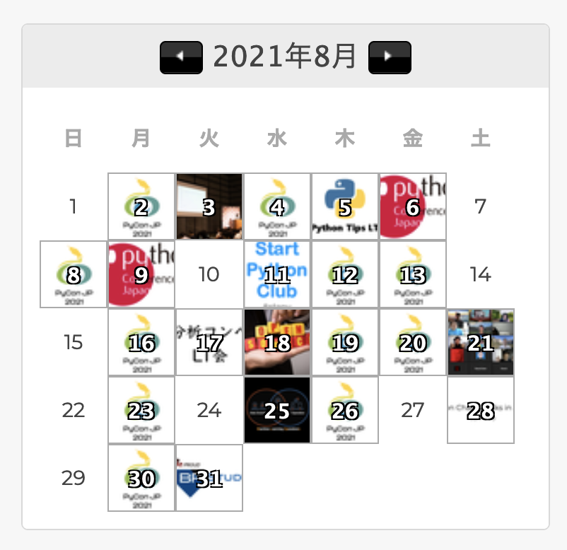

.. role:: raw-html(raw)
    :format: html

========================================================================================================================
週に数回connpassのイベントを作るPyCon JPスタッフは、Heliumを使って自動化しました
========================================================================================================================

週に数回connpassのイベントを作るPyCon JPスタッフは、Heliumを使って自動化しました
========================================================================================================================

:Event: Python Charity Talks in Japan
:Presented: 2021/09/11 nikkie

お前、誰よ
============================================================

* Python大好き **にっきー** （:raw-html:`<i class="fab fa-twitter"></i>` `@ftnext <https://twitter.com/ftnext>`_ / :raw-html:`<i class="fab fa-github"></i>` `@ftnext <https://github.com/ftnext>`_）
* PyCon JP 2021 座長🇨🇭
* アニメも大好き。最近好きな挨拶「うぃっす✌️」🐙

お前、誰よ（ ``@skip`` ）
------------------------------------------------

* Python歴もうじき4年。株式会社ユーザベースのデータサイエンティスト（NLPer）
* `Start Python Club（みんなのPython勉強会） <https://startpython.connpass.com/>`_ 4代目LT王子、スタッフ
* 最近エモかったPEP：Inadaさんによる `PEP597 <https://www.python.org/dev/peps/pep-0597/>`_

週に数回connpassのイベントを作る **PyCon JP** スタッフは、Heliumを使って自動化しました
========================================================================================================================

``import PythonConference as`` **PyCon**
------------------------------------------------

Pythonについてのカンファレンス（国際会議）

**10/15(金), 16(土)** 開催です！
------------------------------------------------

.. raw:: html

    <iframe width="640" height="480" src="https://2021.pycon.jp/" title="PyCon JP 2021 Webサイト"></iframe>

PyCon JP 2021 **チケット発売中** ！🎫
------------------------------------------------

* https://pyconjp.connpass.com/event/221241/ （申込250名(50%)超え🎉）
* 早期購入特典🍕、まだ間に合う！🇲🇬

PyCon JP 2021では現在（ ``@skip`` ）
------------------------------------------------

* `9/17(金)まで <https://pyconjp.blogspot.com/2021/09/closed-sponsor-application.html>`_ 、 `スポンサー募集中 <https://pyconjp.blogspot.com/2021/06/pycon-jp-2021-2notice-of-start-of.html>`_
* `9月末まで、サポートスタッフを募集中 <https://pyconjp.blogspot.com/2021/09/pyconjp-2021-support-staff.html>`_ Help, please!🙏
* :raw-html:`<i class="fab fa-twitter"></i>` `@pyconjapan <https://twitter.com/pyconjapan>`_ や `PyCon JP Blog <https://pyconjp.blogspot.com/search/label/pyconjp2021>`_ で発信しています。フォローしてもらえると嬉しいです😃

週に数回 **connpass** のイベントを作るPyCon JPスタッフは、Heliumを使って自動化しました
========================================================================================================================

いつもお世話になっております🙇‍♂️
------------------------------------------------

.. figure:: ../_static/pycharity_Sep_lt/202109_connpass_first_view.png

    https://connpass.com/

今日申し込んだ方は利用済み✅
------------------------------------------------

.. figure:: ../_static/pycharity_Sep_lt/202109_pycharity_connpass.png
    :scale: 50

    https://pyconjp.connpass.com/event/218154/

PyCon JP スタッフとconnpass
------------------------------------------------

    スタッフmtgの参加者管理に利用

`PyCon JP スタッフナレッジベース connpassの項 <https://pyconjp.atlassian.net/wiki/spaces/pyconjp/pages/1019150497/connpass>`_ より

スタッフmtgの例
------------------------------------------------

.. figure:: ../_static/pycharity_Sep_lt/202109_recent_staff_mtg.png
    :scale: 50

    https://pyconjp-staff.connpass.com/event/224823/

**週に数回** connpassのイベントを作るPyCon JPスタッフは、Heliumを使って自動化しました
========================================================================================================================

nikkieのconnpassカレンダー
------------------------------------------------

    週に2つはPyCon JP 2021ロゴ🐍がありますね

この機に集計：半年間、週2回以上
------------------------------------------------

.. raw:: html

    
    <canvas id="myChart" width="800" height="600"></canvas>
    

週に数回connpassのイベントを作るPyCon JPスタッフは、 **Helium** を使って自動化しました
========================================================================================================================

Helium
------------------------------------------------

* **ブラウザ操作自動化** ライブラリ
* Seleniumのラッパーで、 非常に簡単に書ける！💫（次へ⏬）
* :raw-html:`<i class="fab fa-github"></i>` https://github.com/mherrmann/selenium-python-helium (2600 star)

こんなに簡単です🍰
------------------------------------------------

.. code-block:: python
    :linenos:

    from helium import *
    start_chrome("google.com")  # 1. Chrome立ち上げ、「helium」についてGoogle検索
    write("helium selenium github")
    press(ENTER)
    click("mherrmann/helium")  # 検索結果の中からクリック
    go_to("github.com/login")  # 2. 別の例：GitHubにログイン
    write("username", into="Username")
    write("password", into="Password")
    click("Sign in")
    kill_browser()  # Chrome終了

https://github.com/mherrmann/selenium-python-helium/blob/master/docs/cheatsheet.md

週に数回connpassのイベントを作るPyCon JPスタッフは、Heliumを使って **自動化しました**
========================================================================================================================

単調な作業の繰り返し😫
------------------------------------------------

* ブラウザのシークレットウィンドウ立ち上げ
* スタッフ共通アカウントを確認し、ログイン（👈これが毎回面倒でした）
* 既存のイベントの「コピーを作成」

デモの時間です！ 🤖「見てもらおうか」
------------------------------------------------

connpassのイベント作成を自動化🙌
------------------------------------------------

1. スタッフ共通アカウントでconnpassにログイン
2. 指定した既存のイベントの「コピーを作成」押下（確認ポップアップを出す）

:raw-html:`<i class="fab fa-github"></i>` `copy_existing_event.py <https://github.com/ftnext/connpass-ops-playbook/blob/fed230ef2efbd5b1c0bf03ec18da27403f75f960/examples/copy_existing_event.py>`_

まとめ🌯：週に数回connpassのイベントを作るPyCon JPスタッフは、Heliumを使って自動化しました
========================================================================================================================

PyCon JP 2021 チケットお願いします🐦🍕🙏
------------------------------------------------

https://pyconjp.connpass.com/event/221241/

週2くらいでconnpassイベントを作る方へ
------------------------------------------------

* :raw-html:`<i class="fab fa-github"></i>` https://github.com/ftnext/connpass-ops-playbook
* 「指定したイベントのコピー」「参加者情報CSVのダウンロード」現在サポート
* 詳しくはAppendixへ

pycharity の後は **pyconjp** で！
------------------------------------------------

その後に `pycon_shizu <https://shizuoka.pycon.jp/2021>`_ や `pyconk <https://kyushu.pycon.jp/2022/>`_ もありますね😊

🎫🙏🐦🍕
------------------------------------------------

ご清聴ありがとうございました

**Appendix** が続きます（よろしければどうぞ！）

Appendix
============================================================

* :raw-html:`<i class="fab fa-github"></i>` `connpass-ops-playbook <https://github.com/ftnext/connpass-ops-playbook>`_
* Heliumチートシート
* PyCon JP 2021スタッフが開催したイベントの集計
* Future Works
* LTへのフィードバック

:raw-html:`<i class="fab fa-github"></i>` `connpass-ops-playbook <https://github.com/ftnext/connpass-ops-playbook>`_
====================================================================================================================================================================================

* もともと https://github.com/ftnext/python-as-pyconjp-staff/tree/master/mtg_secretary/connpass で自動化していた
* **今回のLTを機に** 共通化できる部分を切り出した（パッケージ化したい）
* スクリプトの見た目かっこよくしたくて、connpass-ops-playbook作成（開発中！）

.. raw:: html

    </section>
    <section >

.. raw:: html

    <blockquote class="twitter-tweet">
<a href="https://twitter.com/hashtag/pyhack?src=hash&amp;ref_src=twsrc%5Etfw">#pyhack</a> の成果物はこんな感じになりました<a href="https://t.co/Di3uFSfUE2">https://t.co/Di3uFSfUE2</a>  操作するブラウザの指定や、ログイン操作の部分がデコレータで書けたのが、気に入っています♬  @ using_firefox @ logged_in def show_copy_popup(url):  ...  9/11 <a href="https://twitter.com/hashtag/pycharity?src=hash&amp;ref_src=twsrc%5Etfw">#pycharity</a> をお楽しみに！ <a href="https://t.co/7r9vyhnsJH">https://t.co/7r9vyhnsJH</a>
&mdash; nikkie 📣PyCon JP 2021 スタッフ募集中！ (@ftnext) <a href="https://twitter.com/ftnext/status/1429101000573341698?ref_src=twsrc%5Etfw">August 21, 2021</a></blockquote> 

この書き方、かっこよくないですか？😎
------------------------------------------------

.. code-block:: python
    :linenos:

    from connpass_ops_playbook.decorators import logged_in, using_firefox
    from connpass_ops_playbook.plays import copy_existing_event

    @using_firefox
    @logged_in
    def show_copy_popup(url):
        copy_existing_event(url, human_confirms=True)

:raw-html:`<i class="fab fa-github"></i>` `copy_existing_event.py <https://github.com/ftnext/connpass-ops-playbook/blob/fed230ef2efbd5b1c0bf03ec18da27403f75f960/examples/copy_existing_event.py>`_

補足：コピーの確認ポップアップ
------------------------------------------------

* **ポップアップ操作も自動化できます**
* デモが確認ポップアップを出すまでだったのは、LT練習で不要なイベントを作らないようにするためです
* `デモのスクリプトをVSCodeのUIで見られるリンク <https://github.dev/ftnext/connpass-ops-playbook/blob/main/examples/copy_existing_event.py>`_ （実装の詳細は ``connpass_ops_playbook`` 以下をどうぞ）

Heliumチートシート
============================================================

* 「こんなに簡単です」スライドのコードも `チートシート <https://github.com/mherrmann/selenium-python-helium/blob/master/docs/cheatsheet.md>`_ から
* **できる操作と書き方がつかめる** ので、一読をオススメします！
* 「python helium」で検索すると、日本語の情報も見つかるようになってきました

PyCon JP 2021スタッフが開催したイベントの集計
============================================================

* https://pyconjp-staff.connpass.com/event/ から2021年のイベントをスクレイピング
* イベントのタイトルと開催日を中間ファイルに保存し、 **開催月** で集計

集計ソースコード
------------------------------------------------

* :raw-html:`<i class="fab fa-github"></i>` `samplecode/pycharity <https://github.com/ftnext/2021_slides/tree/1afdde62270c69be94f67793809e4327db0e58ca/samplecode/pycharity>`_
* ダウンロードまたはcloneし、仮想環境を有効にしてから ``make all`` で動くと思います

robots.txtを守って楽しくスクレイピング！
------------------------------------------------

* https://connpass.com/robots.txt で確認できます

Future Works
============================================================

* 現在は人が定期的に実行している➡️ **自動** で定期実行
* 他のスタッフも使えるようにしたい（ **Slack** opsが理想🌟）

LTへのフィードバック
============================================================

LT中にZoomでいただいたコメントに回答します

* ログインを待つ制御の実装

ログインを待つ制御の実装
------------------------------------------------

* ``wait_until`` を使っています
* https://selenium-python-helium.readthedocs.io/en/latest/api.html#helium.wait_until

.. code-block:: python

    click("ログインする")
    # ログインをクリックした後、ダッシュボードのテキストが見つかるまで待ちます
    wait_until(Text("あなたのイベント").exists)

補足：ログインを待つ制御の実装
------------------------------------------------

* ログインに使うアカウント情報（メールアドレスとパスワード）
* それぞれ **環境変数** で渡しています

EOF
============================================================
