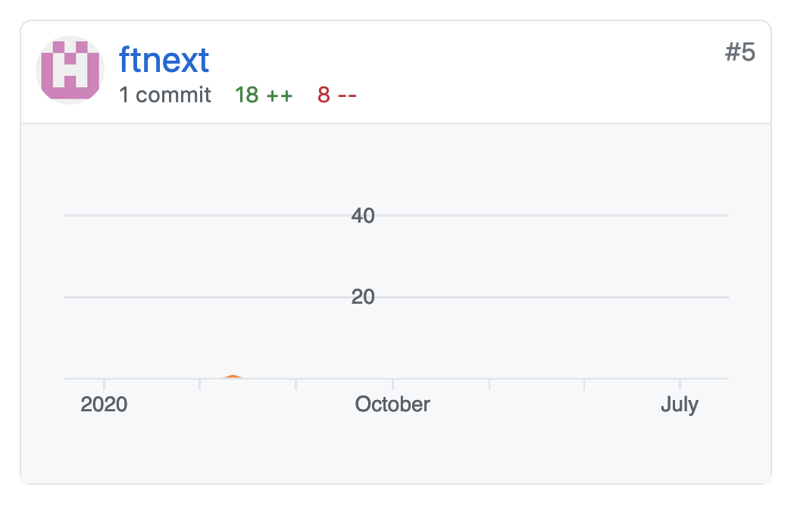
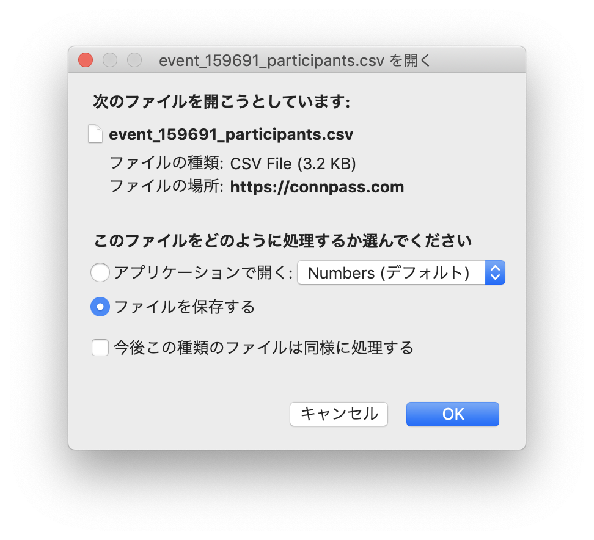

.. role:: raw-html(raw)
    :format: html

============================================================
私が初めてコードでコントリビュートしたときの話
============================================================

:Event: ラクス OSS LT会 vol.2
:Presented: 2021/08/18 nikkie

お前、誰よ
============================================================

* Python大好き **にっきー** （:raw-html:`<i class="fab fa-twitter"></i>` `@ftnext <https://twitter.com/ftnext>`_ / :raw-html:`<i class="fab fa-github"></i>` `@ftnext <https://github.com/ftnext>`_）
* Python歴3年半。データサイエンティストにしてNLPer

Python Conference JP 2021 座長🇨🇭
------------------------------------------------

.. raw:: html

    <iframe width="640" height="480" src="https://2021.pycon.jp/" title="PyCon JP 2021 Webサイト"></iframe>

2月の vol.1 でもLTしました⚡️
------------------------------------------------

.. raw:: html

    <iframe width="800" height="480" src="https://ftnext.github.io/2021_slides/rakus_Feb_oss/not_only_code_but_various_contributions.html" title="コードだけじゃない！いろいろなコントリビュート"></iframe>

アニメも好きです😍
------------------------------------------------

* 1つ挙げると『ハイキュー!!』🏐（ `あらすじ <https://alu.jp/series/%E3%83%8F%E3%82%A4%E3%82%AD%E3%83%A5%E3%83%BC%EF%BC%81%EF%BC%81>`_）
* ブロッカー月島（ツッキー）のエピソードが好き

TODO：イチ推しのツッキーのエピソードはYouTubeで見られます！！
------------------------------------------------------------------------------------------------

.. raw:: html

    <iframe width="560" height="315" src="https://www.youtube.com/embed/ycfEo598B5c" title="YouTube video player" frameborder="0" allow="accelerometer; autoplay; clipboard-write; encrypted-media; gyroscope; picture-in-picture" allowfullscreen></iframe>

ツッキーが言われるセリフ
------------------------------------------------

    それがお前がバレーにハマる瞬間だ（木兎さん）

実は今回のタイトルも意識しました

それがお前がバレーにハマる瞬間だ✨
------------------------------------------------

* このLT「私が初めてコードでコントリビュートしたときの話」
* 言い換えると、nikkieにとっての **OSSにハマる瞬間** の話

お品書き
------------------------------------------------

* 初めてコードでコントリビュートした事例紹介
* 振り返り：なぜコントリビュートできたか

LT：私が初めてコードでコントリビュートしたときの話
------------------------------------------------------------------------------------------------

* **初めてコードでコントリビュートした事例紹介**
* 振り返り：なぜコントリビュートできたか

質問：Pythonライブラリ **Helium** を知っていますか？
============================================================

Helium
------------------------------------------------

* :raw-html:`<i class="fab fa-github"></i>` https://github.com/mherrmann/selenium-python-helium (2600 star)
* できること：ブラウザ操作自動化
* Seleniumのラッパーで、 **非常に簡単** に書ける！💫

こんなに簡単です🍰
------------------------------------------------

.. code-block:: python
    :linenos:

    from helium import *
    start_chrome("google.com")
    write("helium selenium github")
    press(ENTER)
    click("mherrmann/helium")
    go_to("github.com/login")
    write("username", into="Username")
    write("password", into="Password")
    click("Sign in")
    kill_browser()

https://github.com/mherrmann/selenium-python-helium/blob/master/docs/cheatsheet.md

It's me!😎
------------------------------------------------

https://github.com/mherrmann/selenium-python-helium/graphs/contributors

経緯：ときは2020年5月
------------------------------------------------

* connpassから `参加一覧をCSV形式で <https://help.connpass.com/organizers/event-admin.html>`_ 定期的にダウンロード。自動化したい
* ブラウザ自動化が簡単に書けるHeliumを知っていた
* Google Chromeで試したら、サクッとダウンロードできた！🙌

普段使いはFirefox
------------------------------------------------

* Chromeと同じコードでは動かない😢
* ダウンロードの **確認ポップアップ** のため

これのことです、Firefoxの確認ポップアップ
------------------------------------------------

確認ポップアップ抑制したい
------------------------------------------------

* Seleniumでの抑制例が見つかる ``options.setPreference()``

  * https://stackoverflow.com/a/36309735

* Heliumではどうやる？ Issueを見てみる🔍

Ability to set download directory and **disable download or open popup** using Firefox
------------------------------------------------------------------------------------------------

https://github.com/mherrmann/selenium-python-helium/issues/19

`Ownerのコメント <https://github.com/mherrmann/selenium-python-helium/issues/19#issuecomment-617803108>`_
------------------------------------------------------------------------------------------------------------------------------------------------------------------------------------------------

    Helium lets you supply ChromeOptions to start_chrome since the last release. Maybe something similar could be added for Firefox?

    I won't have time to implement this. But I will be happy to merge a PR that does it.

Ownerのコメント意訳
------------------------------------------------

* Heliumは最新のリリース(v3.0.2)で ``start_chrome`` 関数に ``ChromeOptions`` を提供できるようになった。おそらくFirefoxについても同様のものを加えられるんじゃないか
* 実装している時間がない。でも、それをするPRは喜んでマージするよ

手元のFirefoxでだけでも動かせれば！
------------------------------------------------

* ``start_chrome`` のコードを見てみる（ならって ``start_firefox`` をハックしようとした）
* 「 **あ、これ実装できるかも** 」

（環境構築でハマりつつも）できた！🙌
------------------------------------------------

* https://github.com/mherrmann/selenium-python-helium/pull/22/files
* Helium v3.0.3 としてリリースされた

LT：私が初めてコードでコントリビュートしたときの話
------------------------------------------------------------------------------------------------

* 初めてコードでコントリビュートした事例紹介
* **振り返り：なぜコントリビュートできたか**

振り返り：なぜコントリビュートできたか
============================================================

1. Issueを見る習慣が付いていた
2. GitHubでのOSS開発フローに慣れていた
3. Pythonのテストに慣れていた
4. ちょうど実装できるIssueが開かれたばかりだった

振り返り：なぜコントリビュートできたか
------------------------------------------------

1. **Issueを見る習慣が付いていた**
2. GitHubでのOSS開発フローに慣れていた
3. Pythonのテストに慣れていた
4. ちょうど実装できるIssueが開かれたばかりだった

1.Issueを見る習慣が付いていた
------------------------------------------------

* Pythonを始めた頃に参加した勉強会（2018/03）での学び
* **ライブラリのドキュメントにないときは、GitHubのIssueを検索する**
* Issue検索で助けられた経験多数（ `テクニックとしてオススメしたことも <https://docs.google.com/presentation/d/1YP03-0THNmWLdqIi_hrcgi-k7y_2G7jj5iWXf973Ew4/edit#slide=id.g774fdc25c3_0_320>`_）

参考：「入門書を読み終わったらなにしよう？」
------------------------------------------------

* スライド：https://www.slideshare.net/laughk/python-webapi-nextsteppythonprograming
* 私のメモ：https://nikkie-ftnext.hatenablog.com/entry/2018/03/08/002016
* 注：今回スライドを見返したところ、Issue検索は明記されておらず、どうやら質疑や懇親会で聞いたようです

振り返り：なぜコントリビュートできたか
------------------------------------------------

1. Issueを見る習慣が付いていた
2. **GitHubでのOSS開発フローに慣れていた**
3. Pythonのテストに慣れていた
4. ちょうど実装できるIssueが開かれたばかりだった

2.GitHubでのOSS開発フローに慣れていた
------------------------------------------------

* vol.1でのLT「コードだけじゃない！いろいろなコントリビュート」
* 翻訳を通して、GitHubのIssueやPull requestに慣れた
* コードを書かなかったが、 **コードでコントリビュートするための準備** をしていた

振り返り：なぜコントリビュートできたか
------------------------------------------------

1. Issueを見る習慣が付いていた
2. GitHubでのOSS開発フローに慣れていた
3. **Pythonのテストに慣れていた**
4. ちょうど実装できるIssueが開かれたばかりだった

3.Pythonのテストに慣れていた
------------------------------------------------

* Pythonは独学で始め、2019年にデータサイエンティストに転職（ユーザベース）
* **TDD** で開発する環境（ `ユーザベースの例 <https://zine.qiita.com/event/202106-uzabase/>`_）
* ``unittest`` やモックを **猛練習** の末に、スラスラ書けるように

Heliumのコードを直した際
------------------------------------------------

* テストコードのどこを直すか自信を持って判断できた

  * ``start_chrome`` 関数では ``options`` 引数のテストがないことにならった

* 余談：テストが全部通らなくて、別途Issueを開きもした（ `#23 <https://github.com/mherrmann/selenium-python-helium/issues/23>`_）

振り返り：なぜコントリビュートできたか
------------------------------------------------

1. Issueを見る習慣が付いていた
2. GitHubでのOSS開発フローに慣れていた
3. Pythonのテストに慣れていた
4. **ちょうど実装できるIssueが開かれたばかりだった** （運！）

まとめ🌯：私が初めてコードでコントリビュートしたときの話
============================================================

* **Helium** というPython製ライブラリに、初めてコードでコントリビュートした
* なぜコントリビュートできたか、 **4点** 共有

OSSにハマった瞬間の先
------------------------------------------------

* Heliumのように新しめのOSSのコードを読み始めた
* 「そんな書き方できるのか。かっこいい！！」 **もう楽しくてしょうがない**
* 🤫 OSSのコード読んでいるだけで、生活に困らないだけのお金もらえないかな・・

コードでコントリビュートしてみたい方へ
------------------------------------------------

1. 普段から **Issueをのぞこう**
2. GitHubのIssueやPull requestを使って **OSS開発フロー** に慣れよう
3. **テストコード** に慣れよう
4. 1〜3ができているなら、タイミングが来たら飛び込むだけ

ご清聴ありがとうございました
------------------------------------------------

* Next, **YOUR** turn!
* 次は皆さんが、初めてコードでコントリビュートする番です！

Appendix
============================================================

過去のHelium関連のアウトプット
------------------------------------------------

* `繰り返すブラウザ操作をPythonにやらせよう <https://github.com/ftnext/2020_slides/blob/master/stapy_May_helium_auto_browser/PITCHME.md>`_ （2020/05 LT）

Heliumにコントリビュートした際のTwitterログ 1/2
------------------------------------------------

.. raw:: html

    <blockquote class="twitter-tweet">
ダウンロード、Chromeはデフォルトでポップアップが出ないので、以下を参考に指定すれば達成できました（最新のHelium v3.0.2でChromeOptionsがサポートされている）<a href="https://t.co/IeyINOhYJJ">https://t.co/IeyINOhYJJ</a>  Firefoxはデフォルトでポップアップが出ますが、以下を参考に抑制できそう<a href="https://t.co/363vPwQ3nW">https://t.co/363vPwQ3nW</a>
&mdash; nikkie 📣PyCon JP 2021 スタッフ募集中！ (@ftnext) <a href="https://twitter.com/ftnext/status/1256980377790369793?ref_src=twsrc%5Etfw">May 3, 2020</a></blockquote>  

Heliumにコントリビュートした際のTwitterログ 2/2
------------------------------------------------

.. raw:: html

    <blockquote class="twitter-tweet">
本日コードでOSSに貢献という実績を解除しました！やったー  heliumのIssueに出ていたoptions引数を<a href="https://t.co/Zk8RwW48K3">https://t.co/Zk8RwW48K3</a> Chromeの実装例をもとに実装しました（Firefoxでのダウンロードが自分に必要だったので）。 FirefoxOptionsを設定できるようになったhelium v3.0.3が近いうちにリリースです <a href="https://t.co/lEIuit5veE">https://t.co/lEIuit5veE</a>
&mdash; nikkie 📣PyCon JP 2021 スタッフ募集中！ (@ftnext) <a href="https://twitter.com/ftnext/status/1257227781550698496?ref_src=twsrc%5Etfw">May 4, 2020</a></blockquote>  

EOF
============================================================
