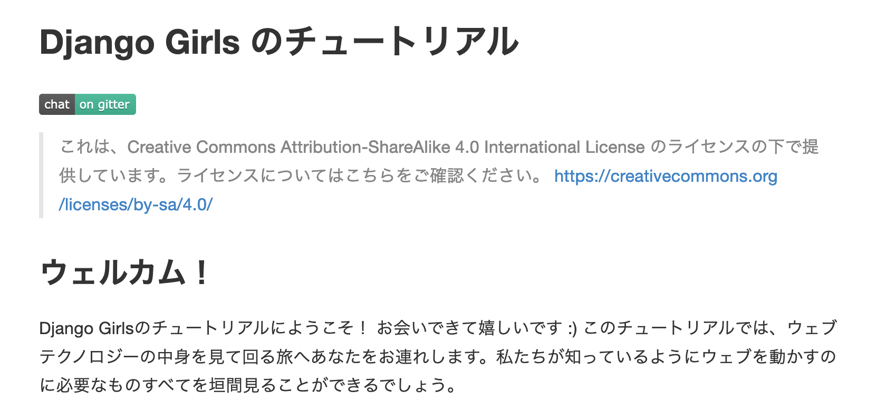

============================================================
コードだけじゃない！いろいろなコントリビュート
============================================================

:Event: ラクス OSS LT会
:Presented: 2021/02/03 nikkie

お前、誰よ (About nikkie)
============================================================

* ハンドルネーム「にっきー」（Twitter `@ftnext <https://twitter.com/ftnext>`_ / GitHub `@ftnext <https://github.com/ftnext>`_）
* 2016〜 ソフトウェアエンジニア 日本語、PHP、etc
* 業務や趣味でPython🐍書いています（2019〜 データサイエンティスト）
* Love anime!!（＠　🎺🎷🔥　🌈　🏔🏕）

LT：コードだけじゃない！いろいろなコントリビュート
============================================================

* 私はコードをバリバリ書いてコントリビュートしているわけではない
* コントリビュートしたいので、**コード以外の道** を模索。それを共有します

コード以外でのコントリビュート
------------------------------------------------

* チュートリアルを英語から日本語へ翻訳
* ドキュメントやコードのtypo指摘
* カンファレンスや勉強会スタッフ（PyCon JP 2019〜スタッフ、2021 座長）
* Teaching Assistant (TA)

コントリビュート、なぜやりたいのか？
============================================================

* 3年前、Pythonを独学で始めた
* `コミュニティのもくもく会で教わる <https://gitpitch.com/ftnext/2019_slides/master?p=pynyumon_May_mokumoku_teach/#/3/3>`_
* 初めて半年経った頃「受け取ったもの多数。`できる範囲で返していきたい <https://gitpitch.com/ftnext/2019_slides/master?p=pynyumon_May_mokumoku_teach/#/5/1>`_」

コミュニティから受け取ったもののお返しを
------------------------------------------------

* いただいたものをコミュニティに返す
* とはいえ先を行く人に返すのは難しそう
* 自分がしてもらったことを、**次のPython入門者につなぐ** ことはできる！（`TAを始めた <https://gitpitch.com/ftnext/2019_slides/master?p=pynyumon_May_mokumoku_teach/#/5/2>`_）

お品書き：これまで経験したコントリビュートを共有します
------------------------------------------------

* チュートリアルを英語から日本語へ *翻訳*
* ドキュメントやコードの *typo指摘*
* *カンファレンススタッフ*

LT：コードだけじゃない！いろいろなコントリビュート
============================================================

* **チュートリアルを英語から日本語へ翻訳**
* ドキュメントやコードのtypo指摘
* カンファレンススタッフ

`Django Girls Tutorial <https://tutorial.djangogirls.org/ja/>`_ 翻訳に参加（2018〜）
------------------------------------------------------------------------------------------------

Django Girls Tutorial とは
------------------------------------------------

* Django Girls Workshop（**プログラミング入門者向け** ワークショップ）の教材

  * Webに公開されており、誰でも利用できます

* Django（Python製Webフレームワーク）を使ってWebアプリ（ブログ）を作る

翻訳の経緯
------------------------------------------------

* 2018/05 `Django Congress JP 2018 <https://djangocongress.jp/2018>`_
* 当時のnikkieはDjango Girls Tutorialを終えたくらいのDjango入門者🔰
* Sprint（Django本体の開発やDjangoドキュメントの翻訳を集まって行う）にも申し込んでみた

スプリントが迫る中
------------------------------------------------

* 「Django入門レベルでSprintへの申込みは夢見すぎだったかも。。」🥺 🥺 🥺
* LTでDjango Girls Tutorial翻訳の参加者募集
* 「Tutorialは1周したし、英語でドキュメントも読むから、やれるかも！」🙋‍♂️

翻訳に飛び込んでみて🐸
------------------------------------------------

.. raw:: html

    <blockquote class="twitter-tweet">
<a href="https://twitter.com/hashtag/djangocongress?src=hash&amp;ref_src=twsrc%5Etfw">#djangocongress</a>  day2 スプリント終了〜。おつかれさまでしたー。  2日間ともDjangoに関わる全ての人のためのイベントだったと感じています。 どんなレベルでもOSSには関われるし、レベルが上がれば色んな関わり方ができるんだなぁと  翻訳に挑戦したことで学びもあったので、これはあとでブログに
&mdash; nikkie (@ftnext) <a href="https://twitter.com/ftnext/status/998133652692205573?ref_src=twsrc%5Etfw">May 20, 2018</a></blockquote> 

翻訳に飛び込んでみて🐸
------------------------------------------------

* **入門レベルから** 熟練レベルまで、OSSには関われる💪
* 副次的効果として、正確に翻訳しようとする中でTutorialの内容への理解が深まった

LT：コードだけじゃない！いろいろなコントリビュート
============================================================

* チュートリアルを英語から日本語へ翻訳
* **ドキュメントやコードのtypo指摘**
* カンファレンススタッフ

typo指摘でコントリビュート（2020〜）
------------------------------------------------

* `Pythonの公式ドキュメント 日本語版へのIssues <https://github.com/python-doc-ja/python-doc-ja/issues?q=is%3Aissue+author%3Aftnext+is%3Aclosed>`_
* PyTorch LightningのDocument `PR <https://github.com/PyTorchLightning/pytorch-lightning/pull/4346>`_
* blackのコード中のdocstring `PR <https://github.com/psf/black/pull/1885>`_

typoを見つけるシーン
------------------------------------------------

* ドキュメントを読み込んでいるとき
* チュートリアルを写経しているとき

たかがtypo、されどtypo
------------------------------------------------

* typoは日本語や英語の **バグ** 🐛。かつ、**すぐ修正できる** 🦅
* 同じように他の人もひっかかるはず
* 👉見つけたら直すか、少なくとも知らせる ようにしています

typo指摘のお供に
------------------------------------------------

* 修正する際に、**同じページに同様のtypoがないか** 探したい🔍
* 英語のtypo指摘にオススメ！ VSCode拡張 `Code Spell Checker <https://marketplace.visualstudio.com/items?itemName=streetsidesoftware.code-spell-checker>`_
* 拡張を使って根絶やしにした `例 <https://github.com/attakei/sphinx-revealjs/pull/37>`_

LT：コードだけじゃない！いろいろなコントリビュート
============================================================

* チュートリアルを英語から日本語へ翻訳
* ドキュメントやコードのtypo指摘
* **カンファレンススタッフ**

PyCon JP スタッフ（2019〜）
------------------------------------------------

* PyCon＝Python Conference
* Pythonコミュニティへのお返しとして

好きなLT 『ありがとうと言おう』（PyCon JP 2019）
------------------------------------------------

.. raw:: html

    <iframe width="560" height="315" src="https://www.youtube.com/embed/7U2D5tcMZb4?start=2081" frameborder="0" allow="accelerometer; autoplay; clipboard-write; encrypted-media; gyroscope; picture-in-picture" allowfullscreen></iframe>

カンファレンススタッフ
------------------------------------------------

* PyCon JPのスタッフは **Pythonを書けなくても** 全然やっていきます！
* 他のカンファレンススタッフも同じだと思います
* プログラミングで自動化できたら10x staff🏋️‍♂️になれるかも

私の熱いスタッフ活動（2019）
------------------------------------------------

* PyCon JP Blogに記事を書く✍️
* キーノートスピーカーとメールやり取り📧（『独学プログラマー』のCoryさん）
* 託児室の運営👪

スタッフ活動でコードも書きたい！（2020）
------------------------------------------------

* 繰り返す作業の自動化🤖
* プロポーザルレビューに使うWebアプリを自作
* 詳しくは July Tech Festa 2020 `カンファレンススタッフとしてコードを書いて広げるエンジニアリング・ライフ <https://docs.google.com/presentation/d/1ATNL1J5OtCW3ay3rs8kynULl0cJ6bKJje654XvI8BuM/edit#slide=id.g8cb055e450_0_144>`_

質問：英語でのコミュニケーションは？
============================================================

* コード以外の道でも、英語のコミュニケーションは必要

  * Issueを書く、Pull requestを書く

* 前提：nikkie自身はふだんからドキュメントを英語でも読む（ようになった）

英語を読めれば、ツールを駆使して英語を書ける
------------------------------------------------

1. 日本語を **DeepL翻訳** に入れる
2. 出てきた英語を読んで修正（macOSの **辞書.app** を引く）

英語のドキュメントに当たっているなら大丈夫です！
（`詳しく知りたい方へ <https://nikkie-ftnext.hatenablog.com/entry/stay-home-connect-global-pyconhiro2020>`_）

まとめ：コードだけじゃない！いろいろなコントリビュート
============================================================

* **コードがバリバリ書けなくても** コントリビュートできる！
* このLTが一歩目を踏み出すきっかけになったら嬉しいです

nikkieが経験した、いろいろなコントリビュート
------------------------------------------------------------------------------------------------

* チュートリアルを英語から日本語へ翻訳
* ドキュメントやコードのtypo指摘
* カンファレンスや勉強会スタッフ
* Teaching Assistant (TA)

一歩目の例
------------------------------------------------

* `OSS Gate <https://oss-gate.doorkeeper.jp/>`_ さん
* `PyCon JP 2021 スタッフ募集のお知らせ <https://pyconjp.blogspot.com/2021/01/2021-staff-application-start.html>`_

  * 一緒にカンファレンスを創りませんか？

ご清聴ありがとうございました
------------------------------------------------

    コード以外の道で経験値を稼いだ結果、最近ではPythonを使っているOSSに、小さなコードでコントリビュートできるようになってきて、めちゃくちゃ楽しいです！！
    （`nikkie談 <https://twitter.com/ftnext/status/1355472263345106952?s=20>`_）

Special thanks `sphinx-revealjs <https://github.com/attakei/sphinx-revealjs>`_ by @attakeiさん
