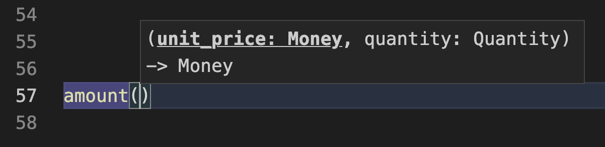

.. role:: raw-html(raw)
    :format: html

============================================================
小ネタ：値オブジェクトで読みやすく（Pythonを例に）
============================================================

:Event: ラクス リーダブルコード LT会 - vol.2
:Presented: 2021/07/07🎋 nikkie

❓ Question（チャット💬 お願いします🙏）
============================================================

みなさん、ふだんどの言語を書いてますか？

インタラクティブにやってみるので、LT中の **Zoomチャット大歓迎** です！

お前、誰よ
============================================================

* 我が名は **にっきー** （:raw-html:`<i class="fab fa-twitter"></i>` `@ftnext <https://twitter.com/ftnext>`_ / :raw-html:`<i class="fab fa-github"></i>` `@ftnext <https://github.com/ftnext>`_）
* **Python歴3年半** ほど。現在は `ユーザベース <https://www.wantedly.com/projects/622337>`_ 所属のデータサイエンティスト

お前、誰よ（承前）
------------------------------------------------

* Love Python!
* Love anime!!（🎺🎷🔥　🌲🌳🐲　📽🎞🎥🎬🧡　🍎🍋🥝🍇🧺）
* PyCon JP 2021 座長🇨🇭

LTするので宣伝させてください🙏
------------------------------------------------

* **Py** thon **Con** ference as PyCon（＝年に一度のPython祭り）
* PyCon JP 2021 10/15(金), 16(土)

  * 15日は `ハイブリッド開催 <https://pyconjp.blogspot.com/2021/07/hybrid-pyconjp-2021-plan-june.html>`_

* 📣 **7/10(土)** までトークのプロポーザル募集中！！ 📣 `募集開始ブログ <https://pyconjp.blogspot.com/2021/05/start-proposal.html>`_

ここから本題：#readablelt
========================================================================================================================

    可読性の高いコードやリファクタリングについてLTでアウトプットしましょう！

`connpass リーダブルコード LT会 - vol.2 <https://rakus.connpass.com/event/215225/>`_

リーダブルといえば
------------------------------------------------

『`リーダブルコード――より良いコードを書くためのシンプルで実践的なテクニック <https://www.oreilly.co.jp/books/9784873115658/>`_』🎼

💬 読んだ方？🙋‍♂️ 聞いたことはある方？🙋‍♀️

私と『リーダブルコード』🎼
========================================================================================================================

* 新卒1年目のとき、会社でおすすめされて読んだ
* 「他の人が最短時間で理解できるように」（1章）👉 **読みやすさ**
* **命名** が特に印象的（他にも早期リターンなど）

「カラフル」🌈
------------------------------------------------

    もっと「カラフル」な単語を探す（2章）

* 情報が伝わる
* 目的に適した明確な名前

    気取った言い回しよりも明確で正確なほうがいい。（2章）

カラフルを求めて🌈
------------------------------------------------

* 変数や関数をカラフルな単語で命名（愚直に実践）
* カラフル優先で、単語数が増え、変数名長くなりがち🤯
* 当時の悩み：カラフルの加減 `ムズイ <https://youtu.be/J9JQrg1ugsk>`_ （`当時のLTスライド <https://github.com/ftnext/2018_LTslides/blob/master/aniben_August_imas/PITCHME.md>`_）

読みやすさについての最近の気づき
------------------------------------------------

* 実践してきた命名だけではなさそう
* 『リーダブルコード』には **外側** がある！
* 気づきの中から、**値オブジェクト** を共有します

値オブジェクト
========================================================================================================================

💬 知ってる方？🙋‍♂️ 聞いたことはある方？🙋‍♀️

* バリューオブジェクトとも
* 脱線：`一人称が「アタイ」のヒロイン <https://twitter.com/kaiinu/status/1360571177677123588?s=20>`_

値オブジェクトと読みやすさの気づき
------------------------------------------------

* 『`現場で役立つシステム設計の原則 <https://gihyo.jp/book/2017/978-4-7741-9087-7>`_』
* 1章「小さくまとめてわかりやすくする」で値オブジェクトを紹介

    値を扱うための専用クラスを作る

値を扱うための専用クラスとは？
------------------------------------------------

* 基本データ型を **属性** として1つか2つ
* コンストラクタで値の範囲の検証（完全コンストラクタ）
* 不変（値オブジェクトを使った計算では、新しい値オブジェクトを返す）

例：``Money`` （金額を扱うクラス）
------------------------------------------------

.. code-block:: python
    :linenos:

    @dataclass(frozen=True)
    class Money:
        value: int  # 基本データ型を属性として1つ

        def __init__(self, value: int) -> None:
            if value < 0:  # 完全コンストラクタ（金額は0円以上）
                raise ValueError("不正: 0未満")
            object.__setattr__(self, "value", value)

例：``Money`` （金額を扱うクラス）続き
------------------------------------------------

.. code-block:: python
    :linenos:
    :lineno-start: 10

    def multiply(self, number: int) -> Money:
        """Moneyを整数倍した、新しいMoneyを作って返す（不変）

        >>> Money(500).multiply(3)
        Money(value=1500)
        """
        return Money(self.value * number)

別の例：``Quantity`` （数量を扱うクラス）
------------------------------------------------

.. code-block:: python
    :linenos:

    @dataclass(frozen=True)
    class Quantity:
        value: int  # 基本データ型の属性

        def __init__(self, value: int) -> None:
            if value < 0:  # 完全コンストラクタ
                raise ValueError("不正: 0未満")
            object.__setattr__(self, "value", value)

値オブジェクトで読みやすく
========================================================================================================================

* 『現場で役立つシステム設計の原則』から読みやすいと思った例
* 注：Pythonの型ヒントが絡みます

補足：Pythonの型ヒント
------------------------------------------------

* 変数や関数の仮引数・返り値の型を表す **ラベル** （コメントに近い）
* 実行時に型をチェックするわけでは **ない**

詳しくは `過去の登壇資料 <https://docs.google.com/presentation/d/1KJlSSS-ZDByqqg_HO0_EFGbXCBqR8OMzzWwz8xvGQkU/edit#slide=id.gac59f1be36_0_318>`_ をどうぞ

値オブジェクトを使わない場合
------------------------------------------------

引数の順番、分かりづらくないですか？（型ヒントがともに ``int``。第1引数は金額？個数？）

.. code-block:: python

    def amount(unit_price: int, quantity: int) -> int:
        """総額計算"""
        return unit_price * quantity

値オブジェクトを使うと
------------------------------------------------

.. code-block:: python

    def amount(unit_price: Money, quantity: Quantity) -> Money:
        # quantity.as_int()で Quantity型からint型に変換
        return unit_price.multiply(quantity.as_int())

**読みやすい** ！

値オブジェクトで読みやすくなった🙌
------------------------------------------------

* 型ヒントを手がかりに、理解にかかる時間が短くなっている印象
* 値オブジェクトで、**どんな値を処理しているか** が明確に
* 例えば、``unit_price`` が ``Money`` （金額）であることは、命名の工夫ではここまで短くできないのでは？

さらに、エディタの補完、わかりやすい！
------------------------------------------------

引数に何をどんな順番で渡せばいいかが明確！（VSCodeでの例）

値オブジェクト & 型ヒントで
------------------------------------------------

* 値オブジェクトによる **不変性**
* 静的型チェック（例： ``Money`` を渡していないと気づける）
* 副次的に読みやすく

とはいえ、シルバーバレットではない
------------------------------------------------

* デメリット： **小さいクラスたくさん** になるので、実装量は増える
* デメリットを軽減する方法を見つけるべく、プライベートで書くスクリプトでやっていき💪

まとめ🌯：値オブジェクトで読みやすく
============================================================

* 『現場で役立つシステム設計の原則』で値オブジェクトを知った
* 値オブジェクトと型ヒントで、関数が読みやすくなる！
* 『リーダブルコード』の外側（**設計で読みやすく** する）に気づいた

ご清聴ありがとうございました
------------------------------------------------

📣 PyCon JP 2021は **7/10(土)** までトークのプロポーザル募集中！🙏

References、**Appendix** が続きます（よろしければどうぞ！）
