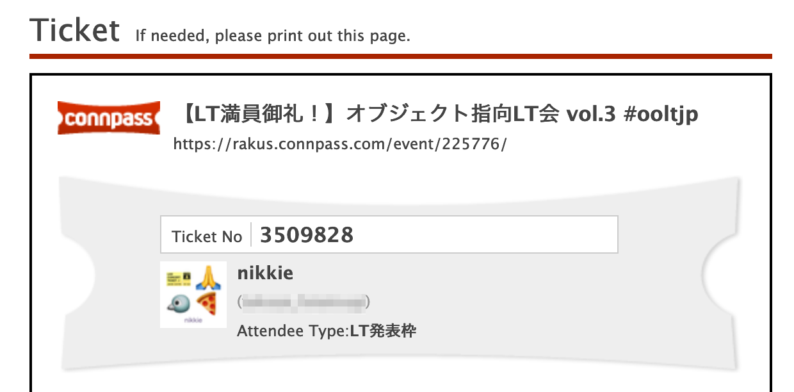

.. role:: raw-html(raw)
    :format: html

========================================================================================================================
そうか、犬や自動車のように、処理もクラスで表せるのか！
========================================================================================================================

:Event: ラクス オブジェクト指向LT会 vol.3
:Presented: 2021/11/24 nikkie

お前、誰よ（≒自己紹介）
============================================================

* Python大好き **にっきー** （:raw-html:`<i class="fab fa-twitter"></i>` `@ftnext <https://twitter.com/ftnext>`_ / :raw-html:`<i class="fab fa-github"></i>` `@ftnext <https://github.com/ftnext>`_）
* Python歴4年。株式会社ユーザベースのデータサイエンティスト（NLPer）
* Python Conference JP 2021 座長（＝開催に責任を持つ人）

アニメも大好き：『`アイの歌声を聴かせて <https://ainouta.jp/>`_』はいいぞ！🤖🎤🎼
------------------------------------------------------------------------------------------------

.. raw:: html

    <iframe width="560" height="315" src="https://www.youtube.com/embed/58q1s6B8lCM" title="YouTube video player" frameborder="0" allow="accelerometer; autoplay; clipboard-write; encrypted-media; gyroscope; picture-in-picture" allowfullscreen></iframe>

`プログラミングの題材にもしています <https://ftnext.github.io/2021_slides/pycon_shizu_lt/enjoy_favorite_anime_with_python.html>`_ （PyCon mini ShizuokaでLT）

オブジェクトとの近況（※オブジェクト指向ではなく **JavaScriptのオブジェクト** です）
------------------------------------------------------------------------------------------------

.. raw:: html

    <blockquote class="twitter-tweet">
プログラミングにおける連想配列、Pythonのdictに親しみすぎたためか、オブジェクトとMapがあるJavaScriptでめっちゃハマりました。 ・オブジェクトのプロパティは[]か . でアクセス ・Mapではgetメソッドを使う（[]や . でアクセスしていてundefinedとなって、あれ？ってなってました）
&mdash; nikkie 📣PyCon JP 2021 ありがとうございました (@ftnext) <a href="https://twitter.com/ftnext/status/1462400950757298181?ref_src=twsrc%5Etfw">November 21, 2021</a></blockquote> 

LT：そうか、犬や自動車のように、処理もクラスで表せるのか！
========================================================================================================================

* **クラスへの苦手意識とその払拭について** 話します
* クラスを使いこなしている感覚はまだ持てていなくて、苦手ではなくなったという共有です

お品書き：そうか、犬や自動車のように、処理もクラスで表せるのか！
------------------------------------------------------------------------------------------------

* クラスへの苦手意識
* 払拭のヒント
* 実践例

クラスへの苦手意識
============================================================

* 例えばPythonなどで、文法的にどう書けばいいかは分かる
* プログラミングで **どう使えばいいか** が長いこと分かりませんでした

.. _徹底攻略 基本情報技術者教科書 平成28年度: https://book.impress.co.jp/books/1115101034

オブジェクト指向設計
------------------------------------------------

    「データ（**属性**）」と「データを操作する手続き（**メソッド**）」を一体化した **オブジェクト** を標準部品として定義し、システムを設計すること

『`徹底攻略 基本情報技術者教科書 平成28年度`_』（p.360）

オブジェクトとクラス
------------------------------------------------

    （前略）オブジェクトを一般化（抽象化）したものを **クラス** と呼び、オブジェクトを作る雛形とします。
    
『`徹底攻略 基本情報技術者教科書 平成28年度`_』（p.361）

オブジェクト・クラス・インスタンス
------------------------------------------------

    クラスから具体的な値を持たせて作ったオブジェクトを **インスタンス（実体）** と呼びます。

『`徹底攻略 基本情報技術者教科書 平成28年度`_』（p.361）

クラスの例：犬
------------------------------------------------

犬というオブジェクトには

* 名前がある
* 芸を覚えさせられる
* 覚えた芸をする

犬を表すクラスの設計
------------------------------------------------

* **名前** がある 👉 ``name`` 属性

.. code-block:: python
    :linenos:

    class Dog:
        def __init__(self, name: str) -> None:
            self.name = name

.. revealjs_break::

* **芸** を覚えさせられる 👉 ``tricks`` 属性。``add_trick`` メソッドで芸を追加

.. code-block:: python
    :linenos:
    :emphasize-lines: 4-5

    class Dog:
        def __init__(self, name: str) -> None:
            self.name = name
            self.tricks = []
        def add_trick(self, trick: str) -> None:
            ...

.. revealjs_break::

* 覚えた **芸** をする 👉 ``trick`` メソッドで ``tricks`` 属性から1つ取り出す

.. code-block:: python
    :linenos:
    :emphasize-lines: 7

    class Dog:
        def __init__(self, name: str) -> None:
            self.name = name
            self.tricks = []
        def add_trick(self, trick: str) -> None:
            ...
        def trick(self) -> str:
            ...

``Dog`` クラス
------------------------------------------------

.. literalinclude:: ../../samplecode/class_examples/dog.py
    :language: python
    :lines: 9,20-31
    :linenos:

``Dog`` クラスのインスタンスと戯れる
------------------------------------------------

.. literalinclude:: ../../samplecode/class_examples/dog.py
    :language: python
    :lines: 13-17
    :linenos:
    :dedent: 4

`Pythonチュートリアルを元に <https://docs.python.org/ja/3/tutorial/classes.html#class-and-instance-variables>`_ 作った例です

クラスの別の例：自動車
------------------------------------------------

タイトルに含みますが、 ``@skip`` します（Appendixへ）

Why programmers? 犬や自動車、どんなプログラムで使うんですか？
========================================================================================================================

* 私の普段のプログラミング、犬も自動車も出てこないんですが・・😅
* これらは **クラスという文法を説明するための例**

クラスを自分の道具にできていないという苦手意識
------------------------------------------------------------------------------------------------

* プログラミングの **どんなシーンでどうクラスを使えばいい** か（＝クラスの使い所）が分からない😖
* クラスを道具として使えないので、使ってきたPythonやPHPでは関数で書くことが多かった

お品書き：そうか、犬や自動車のように、処理もクラスで表せるのか！
------------------------------------------------------------------------------------------------

* クラスへの苦手意識
* **払拭のヒント**
* 実践例

========================================================================================================================
そうか、犬や自動車のように、処理もクラスで表せるのか！
========================================================================================================================

タイトル回収！

払拭のヒント
============================================================

* クラスの使い所が分からないという苦手意識
* **処理** もクラスで表せるという気付き！（〇〇する処理のクラス）
* （全てがクラスであるJavaを経験していたらもっと早く気付けたかも）

お品書き：そうか、犬や自動車のように、処理もクラスで表せるのか！
------------------------------------------------------------------------------------------------

* クラスへの苦手意識
* 払拭のヒント
* **処理をクラスで表す実践例**

処理をクラスで表す実践例
============================================================

* PyCon JP 2021のスタッフ活動で作った **Discord Botの設計** を紹介
* 処理を表すクラスが少しは自分の道具になったかなというタイミングで書きました
* 設計力付けたいので、フィードバック歓迎！

Discord Bot: mogirin（もぎりん）
------------------------------------------------

* 参加者の受付（＝チケットの **もぎり**）を担当
* 参加者は ``@mogirin 1234567`` のように受付番号を伝える
* 受付が済むと参加者にRoleが付き、カンファレンスで使うチャンネルが見えるようになる

connpass受付番号（Ticket No）
------------------------------------------------

connpassご利用ガイド `受付表を確認する <https://help.connpass.com/participants/show-event-ticket.html>`_

登場人物
------------------------------------------------

* Discord：参加者用のRole
* Googleスプレッドシート：connpassの受付番号、受付済みか

.. list-table::
    :header-rows: 1

    * - 受付番号
      - 受付済み
    * - 1234567
      - ✅
    * - 2345678
      - 

受付処理フロー 1/3
------------------------------------------------

* 参加者が入力した受付番号が **スプレッドシートにあるか**
* ある場合は次に進む
* ない場合はエラー送出（入力ミスや別の勉強会の受付番号と取り違えが考えられる）

受付処理フロー 2/3
------------------------------------------------

* 参加者が入力した受付番号で **まだ受付されていないか**

.. list-table::
    :header-rows: 1

    * - 受付番号
      - 受付済み
      - 処理フロー
    * - 1234567
      - ✅
      - エラー送出（入力ミスが考えられる）
    * - 2345678
      - 
      - 次に進む

受付処理フロー 3/3
------------------------------------------------

* 処理フローの1や2でエラーが送出されなければ **受付** する

  * 参加者用のRoleを付与する
  * スプレッドシートの「受付済み」のセルを更新

設計へ：もぎり処理オブジェクト
------------------------------------------------

* スプレッドシートを操作できる（処理フローで使う、値の取得、検索、書き込み）
* DiscordのRoleを付与できる
* もぎりメソッドでもぎり処理を実行する

もぎり処理を表すクラス ``TicketCollector``
------------------------------------------------

* スプレッドシートを操作できる：もぎりで必要な **スプレッドシート操作を表すクラス** を ``searcher`` 属性に持つ

.. code-block:: python
    :linenos:

    class TicketCollector:
        def __init__(self, spreadsheet_id: str) -> None:
            self.searcher = TicketSheetSearcher.from_id(spreadsheet_id)

もぎり処理を表すクラス ``TicketCollector``
------------------------------------------------

.. revealjs_break だと TicketCollector が落ちるバグ

* **もぎりメソッド** でもぎり処理を実行する

.. code-block:: python
    :linenos:
    :emphasize-lines: 4

    class TicketCollector:
        def __init__(self, spreadsheet_id: str) -> None:
            self.searcher = TicketSheetSearcher.from_id(spreadsheet_id)
        async def collect(self, ...):
            ...

もぎり処理を表すクラス ``TicketCollector``
------------------------------------------------

* DiscordのRoleを付与できる：属性には持たせず、**Role付与クラス** のスタティックメソッドを呼び出した（関数でもよい）

.. code-block:: python
    :linenos:
    :emphasize-lines: 6

    class TicketCollector:
        def __init__(self, spreadsheet_id: str) -> None:
            self.searcher = TicketSheetSearcher.from_id(spreadsheet_id)
        async def collect(self, ...):
            ...
            await RoleAttacher.attach(member, role)
            ...

``TicketCollector`` 実装
------------------------------------------------

.. code-block:: python
    :linenos:
    :emphasize-lines: 8,10,12-13

    class TicketCollector:
        def __init__(self, spreadsheet_id: str) -> None:
            self.searcher = TicketSheetSearcher.from_id(spreadsheet_id)

        async def collect(
            self, ticket_number: str, member: discord.Member, role: discord.Role
        ) -> None:
            if not (ticket_cell := self.searcher.find_cell(ticket_number)):
                raise TicketNumberNotFound  # 処理フロー1の例外
            if self.searcher.query_already_collected(ticket_cell):
                raise TicketAlreadyCollected  # 処理フロー2の例外
            await RoleAttacher.attach(member, role)
            self.searcher.register_as_collected(ticket_cell)

ボットの実装： ``TicketCollector`` インスタンスを呼び出す
------------------------------------------------------------------------------------------------

.. code-block:: python
    :linenos:

    collector = TicketCollector(getenv("SPREADSHEET_ID"))

    @bot.event
    async def on_message(message):
        # 省略
        ticket_number = find_ticket_number(message.clean_content)
        reply_message = await collect_ticket(  # collector.collectを呼び出す
            ticket_number, message.author, attendee_role
        )
        await message.channel.send(f"{message.author.mention} {reply_message}")

まとめ🌯：そうか、犬や自動車のように、処理もクラスで表せるのか！
========================================================================================================================

* 犬や自動車の例でクラスの文法を掴んだら、**処理をクラスで表しちゃおう！** （〇〇する処理のクラス）
* オブジェクトに必要な属性とメソッドをまず考え、それをもとにクラスを実装しています

ご清聴ありがとうございました
------------------------------------------------

**Enjoy** development with classes!

Appendixが続きます

クラスの別の例：自動車
------------------------------------------------

自動車というオブジェクトは

* 加速できる
* 減速できる

犬を表すクラスの設計
------------------------------------------------

* **加速** できる： ``speed_up`` メソッドで ``speed`` 属性を操作する

.. code-block:: python
    :linenos:

    class Car:
        def __init__(self) -> None:
            self.speed = 0
        def speed_up(self, value: int) -> int:
            ...

.. revealjs_break::

* **減速** できる： ``speed_down`` メソッド（``speed`` 属性を操作）

.. code-block:: python
    :linenos:
    :emphasize-lines: 6

    class Car:
        def __init__(self) -> None:
            self.speed = 0
        def speed_up(self, value: int) -> int:
            ...
        def speed_down(self, value: int) -> int:
            ...

``Car`` クラス
------------------------------------------------

.. literalinclude:: ../../samplecode/class_examples/car.py
    :language: python
    :lines: 7,16-25
    :linenos:

``Car`` クラスのインスタンスと戯れる
------------------------------------------------

.. literalinclude:: ../../samplecode/class_examples/car.py
    :language: python
    :lines: 9-13
    :linenos:
    :dedent: 4

『`スラスラわかるJava <https://www.shoeisha.co.jp/book/detail/9784798130798>`_』(p.203-204)をPythonで実装した例です

EOF
============================================================
