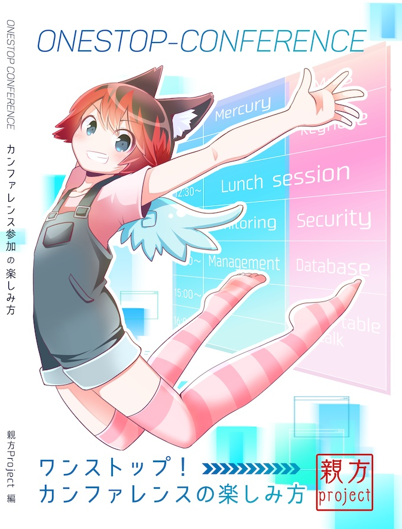

.. role:: raw-html(raw)
    :format: html

========================================================================================================================
カンファレンスに行こう！
========================================================================================================================

:Event: ラクス 情報収集ハック 超LT会 - vol.4
:Presented: 2021/09/01 nikkie

お前、誰よ
========================================================================================================================

* Python大好き **にっきー** （:raw-html:`<i class="fab fa-twitter"></i>` `@ftnext <https://twitter.com/ftnext>`_ / :raw-html:`<i class="fab fa-github"></i>` `@ftnext <https://github.com/ftnext>`_）
* Python歴3年半。株式会社ユーザベースのデータサイエンティスト（NLPer）

お前、誰よ：アニメも大好き
------------------------------------------------

    ういっすういっすういっすー!

`今期のお気に入り作品 🌟💫🐙💫🌟 <https://www.lovelive-anime.jp/yuigaoka/member/>`_ から

情報収集ハック 超LT会
========================================================================================================================

    **技術情報収集のTips** やソースを共有しましょう！

https://rakus.connpass.com/event/220541/ （強調は引用者による）

nikkieからのtips
------------------------------------------------

技術カンファレンス  
（以降「カンファレンス」）

カンファレンスと勉強会（時間の長さ）
========================================================================================================================

* **半日〜1日** 行われる
* 勉強会は1〜2時間くらいが多い

カンファレンスと勉強会（コンテンツ量）
------------------------------------------------

* 複数トラック！（ **情報の宝庫** 🤤）
* 勉強会は単一トラックが多い

技術情報収集にはうってつけ！ カンファレンスに行こう！
------------------------------------------------------------------------------------------------

とっておきのカンファレンス参加ガイド
========================================================================================================================

.. revealjs_break::

『ワンストップ カンファレンス参加の楽しみ方』
------------------------------------------------------------------------------------------------

* https://booth.pm/ja/items/3055339 （書影はこちらから）
* カンファレンスを **知らない** (まだ参加していない人)が、カンファレンスを **楽しむ** のを後押し
* カンファレンスを楽しむ **ノウハウ** がいくつも！

まとめ🌯：カンファレンスに行こう！
========================================================================================================================

* **情報の宝庫** 、カンファレンスに参加してみましょう
* 『 `ワンストップ カンファレンス参加の楽しみ方 <https://booth.pm/ja/items/3055339>`_ 』が **素晴らしいガイド** ！

直近の **Py** thon **Con** ference (10/15, 16)
------------------------------------------------------------------------------------------------

.. raw:: html

    <iframe width="640" height="480" src="https://2021.pycon.jp/" title="PyCon JP 2021 Webサイト"></iframe>

PyCon JP 2021、チケット発売中です！🎫🙏
------------------------------------------------

https://pyconjp.connpass.com/event/221241/

PyCon以外にも
------------------------------------------------

.. list-table::
    :header-rows: 1

    * - 開催日
      - カンファレンス名
    * - 09/03
      - `CI/CD Conference 2021 <https://event.cloudnativedays.jp/cicd2021>`_
    * - 09/18
      - `XP祭り2021 <https://xpjug.com/xp2021/>`_
    * - 10/02-03
      - `PHPカンファレンス2021 <https://phpcon.php.gr.jp/2021/>`_

ご清聴ありがとうございました
------------------------------------------------

Let's go conference!

1分に収まらなかった情報が続きます

Appendix（1分に収まらなかったもの）
============================================================

* 学び始めでもカンファレンスに行っていい？
* 『達人プログラマー』より
* 『ワンストップ カンファレンス参加の楽しみ方』ここがいい！

学び始めでもカンファレンスに行っていい？
============================================================

いいに決まってる！🙆‍♂️🙆（Don't worry）
------------------------------------------------

Djangoのカンファレンス公式さんの言
------------------------------------------------

.. raw:: html

    <blockquote class="twitter-tweet">
まったく問題ありませんよ！トークの内容も幅広いので。もし当日「内容難しいかな」と感じられた場合も「こういうことができるんだ」とキーワードだけお持ち帰りいただければ十分と思います。
&mdash; django-ja (@django_ja) <a href="https://twitter.com/django_ja/status/1397830929024905216?ref_src=twsrc%5Etfw">May 27, 2021</a></blockquote>  

❓学び始めでもカンファレンスに行っていい？
------------------------------------------------

* 全然だいじょうぶ！🙆‍♂️
* *キーワードを持ち帰ろう*
* 『 `ワンストップ カンファレンス参加の楽しみ方 <https://booth.pm/ja/items/3055339>`_ 』も後押ししてくれます

『 `達人プログラマー <https://www.ohmsha.co.jp/book/9784274226298/>`_ 』より
========================================================================================================================

* 第1章 6 あなたの知識ポートフォリオ
* 金融投資と同じように、 **知識にも投資する** という達人の哲学を紹介。具体的に提案

『達人プログラマー』からの提案の1つ（第1章 6）
------------------------------------------------------------------------------------------------

    講習を受講する。  
    近所のコミュニティカレッジや大学、あるいは次に開催されるトレードショーや **カンファレンス** から興味深い講習を探してみましょう。

（強調は引用者による）

詳しくは以下をどうぞ
------------------------------------------------

* https://scrapbox.io/nikkie-memos/Dave%E3%81%95%E3%82%93%E3%83%88%E3%83%BC%E3%82%AF_%E3%83%89%E3%83%AC%E3%82%A4%E3%83%95%E3%82%A1%E3%82%B9%E3%83%A2%E3%83%87%E3%83%AB
* 『達人プログラマー』で有名な「1年に1つの新しい言語」も **知識のポートフォリオ** の投資手段のひとつなんですね！

『ワンストップ カンファレンス参加の楽しみ方』ここがいい！
========================================================================================================================

.. raw:: html

    <blockquote class="twitter-tweet">
戦利品の中で『ワンストップ！カンファレンスの楽しみ方』がぶっ刺さっています。 カンファレンスを知らない（まだ参加していない人）がカンファレンスを楽しみ、登壇に挑戦するまでを後押しするめっちゃいい一冊だなーと。 勝手にnikkieブックスアワードです😆<a href="https://t.co/3maJEkhBF1">https://t.co/3maJEkhBF1</a> <a href="https://twitter.com/hashtag/%E6%8A%80%E6%9B%B8%E5%8D%9A?src=hash&amp;ref_src=twsrc%5Etfw">#技書博</a>
&mdash; nikkie 📣PyCon JP 2021 スタッフ募集中！ (@ftnext) <a href="https://twitter.com/ftnext/status/1406256172030521344?ref_src=twsrc%5Etfw">June 19, 2021</a></blockquote> 

nikkie推しポイントは以下
------------------------------------------------

https://scrapbox.io/nikkie-memos/%E3%80%8E%E3%83%AF%E3%83%B3%E3%82%B9%E3%83%88%E3%83%83%E3%83%97%EF%BC%81%E3%82%AB%E3%83%B3%E3%83%95%E3%82%A1%E3%83%AC%E3%83%B3%E3%82%B9%E3%81%AE%E6%A5%BD%E3%81%97%E3%81%BF%E6%96%B9%E3%80%8F%E3%81%93%E3%81%93%E3%81%8C%E6%8E%A8%E3%81%97%E3%83%9D%E3%82%A4%E3%83%B3%E3%83%88%EF%BC%81

EOF
============================================================
