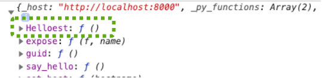

============================================================
2020年の宿題：EelでPythonのクラスを使えるか？
============================================================

:Event: みんなのPython勉強会 #65 LT
:Presented: 2021/01/13 nikkie

お前、誰よ (About nikkie)
============================================================

* ハンドルネーム「にっきー」（Twitter `@ftnext <https://twitter.com/ftnext>`_ / GitHub `@ftnext <https://github.com/ftnext>`_）
* Python歴 3年
* stapy 4代目 **LT王子**
* Love anime!!（＠　🎺🎷🔥　🌈　🏔🏕　🏃‍♀️👹）

師走tapy（しわすたぱい）にて
============================================================

* 登壇「Bring your Python script to more users! 2020冬 stapy ver.」
* `スライド <https://docs.google.com/presentation/d/1Mv3xMknHCZ_mXvGijymuo9IvgWT6XURXfvX_RMNk-XM/edit?usp=sharing>`_
* `YouTube <https://youtu.be/6YsMKnjcoTc?t=1641>`_ （デモしてます）

Bring your Python script to more users!の一コマ
------------------------------------------------

* `Eel <https://github.com/ChrisKnott/Eel>`_ というパッケージを紹介
* Python, HTML, CSS, JavaScriptから **GUIアプリ** が作れる
* Pythonの関数をJavaScriptから呼び出せる

Eelのイメージ
------------------------------------------------

.. code-block:: python

    @eel.expose
    def say_hello():
        return f"Hello World {random.choice(NUMBERS)}"

.. code-block:: html

    

いただいた質問📩
------------------------------------------------

    Eelを使った時に、HTMLからclassを読み出すことも可能ですか?

このLTで回答していきます

Eelを使った時に、HTMLからclassを読み出すことも可能ですか?
------------------------------------------------

1. HTMLの要素のclassを扱いたい？
2. PythonのクラスをJavaScriptで扱いたい？

2への回答を中心に準備してきました

アンジャッシュのコントみたく、質問と噛み合わなかったらすみません🙏

（Eelアプリで）HTMLの要素のclassを扱いたい
============================================================

👉 **JavaScriptでやる** のをオススメします（要素のclassを変更できる）

JavaScriptでHTMLの要素のクラスを変更するコード
------------------------------------------------

`ソース全体 <https://github.com/ftnext/bring-script-more-users/blob/25706dc9053a9c8161d19f52ad1c988c0be3608f/gui/hello/hello.html#L43>`_

.. code-block:: javascript

    let styledElements = document.getElementsByClassName("styled");
    for (var i=0, len=styledElements.length|0; i<len; i=i+1|0) {
      // red-styledクラスからblue-styledクラスに変える
      styledElements[i].classList.remove("red-styled");
      styledElements[i].classList.add("blue-styled");
    }

アプリ例：ボタンクリックでボタンの色が変わる
------------------------------------------------

（Eelアプリで）HTMLの要素のclassを扱いたい
------------------------------------------------

* 👉 **JavaScript** でできます
* 参考： `Element.classList <https://developer.mozilla.org/ja/docs/Web/API/Element/classList>`_

EelアプリでPythonのクラスをJavaScriptから扱いたい
============================================================

* 👉 Pythonのクラスは扱えない（と思われる）
* 👉 クラスの *スタティックメソッド* なら呼び出せた

``@eel.expose`` は「デコレータ」
------------------------------------------------

`Python用語集 <https://docs.python.org/ja/3/glossary.html#term-decorator>`_ によると

    別の関数を返す関数で、通常、 @wrapper 構文で関数変換として適用されます。

.. code-block:: python

    @eel.expose
    def say_hello():
        return f"Hello World {random.choice(NUMBERS)}"

``@eel.expose`` の動き
------------------------------------------------

* ``@eel.expose`` が付いたPythonの関数の名前を **eel.jsに書き込む** （動的！）
* eel.jsが実行された後、JavaScriptのコードでは、``eel.Pythonの関数名`` と呼び出せる（ように見える）
* ``console.log(eel);`` で確認できます

Pythonのクラスにもデコレータは付けられる
============================================================

.. code-block:: python

    @eel.expose
    class Helloest:
        @staticmethod
        def say():
            return "Hello World from Helloest class"

.. code-block:: python

    >>> Helloest.say()
    'Hello World from Helloest class'

JavaScriptのeelオブジェクトがPythonのクラスを持った🙌
------------------------------------------------------------------------------------------------

``eel.Helloest``

しかし、Pythonのクラスのメソッドを呼び出すことはできません🙅‍♂️
------------------------------------------------------------------------------------------------

.. code-block:: javascript

    eel.Helloest.say();
    // raises `Uncaught TypeError: eel.Helloest.say is not a function`

Pythonのクラスのメソッドは、JavaScriptから呼び出せないようです

クラスの各メソッドにデコレータを付けたら？
============================================================

* インスタンスメソッド
* クラスメソッド
* スタティックメソッド

インスタンスメソッド
------------------------------------------------

.. code-block:: python

    class Helloer:
        def __init__(self, name):
            self.name = name

        # JavaScriptでeel.と呼び出すときの名前を指定
        @eel.expose("Helloer_say_instance_method")
        def say_instance(self):
            return f"Hello World from instance method / {self.name}"

.. code-block:: python

    >>> h = Helloer("Alice")
    >>> h.say_instance()
    'Hello World from instance method / Alice'

クラスメソッド
------------------------------------------------

.. code-block:: python

    class Helloer:
        class_var = "BLOND"

        @classmethod
        @eel.expose("Helloer_say_class_method")
        def say_class(cls):
            return f"Hello World from class method / {cls.class_var}"

.. code-block:: python

    >>> Helloer.say_class()
    'Hello World from class method / BLOND'

スタティックメソッド
------------------------------------------------

.. code-block:: python

    class Helloer:
        @staticmethod
        @eel.expose("Helloer_say_static_method")
        def say_static():
            return "Hello World from static method"

.. code-block:: python

    >>> Helloer.say_static()
    'Hello World from static method'

JavaScriptから呼び出した結果
------------------------------------------------

* **スタティックメソッド** は呼び出せた🎉

.. code-block:: javascript

    eel.Helloer_say_static_method();

JavaScriptから呼び出した結果（承前）
------------------------------------------------

* インスタンスメソッド・クラスメソッドは呼び出せない🙅‍♀️
* ``self`` や ``cls`` 引数に該当するオブジェクトがJavaScriptから渡せない模様
* ``self`` や ``cls`` をメソッド内で使っていなければダミーの引数を使って呼び出せる（それはスタティックメソッドでは？）

まとめ：EelでPythonのクラスを使えるか？
============================================================

* スタティックメソッドは呼び出せた
* 思うに、クラスの呼び出しはPython・JavaScriptそれぞれの中で完結。互いに呼び出すときは **言語標準のデータ構造** で
* HTMLのclassについての質問でしたら、JavaScriptでできます

質問 & ご清聴ありがとうございました
------------------------------------------------

* 質問の意図が汲めていなかったら `@ftnext <https://twitter.com/ftnext>`_ までどうぞ
* Special thanks `sphinx-revealjs <https://github.com/attakei/sphinx-revealjs>`_ by @attakeiさん

Appendix
============================================================

* Python 3.8.6, ``Eel==0.14.0``
* `PythonのクラスをexposeしたらJavaScriptからも操作できるか調べる <https://github.com/ftnext/bring-script-more-users/issues/53>`_
* `EelアプリでHTML要素のclassを扱う例を追加する <https://github.com/ftnext/bring-script-more-users/issues/51>`_
